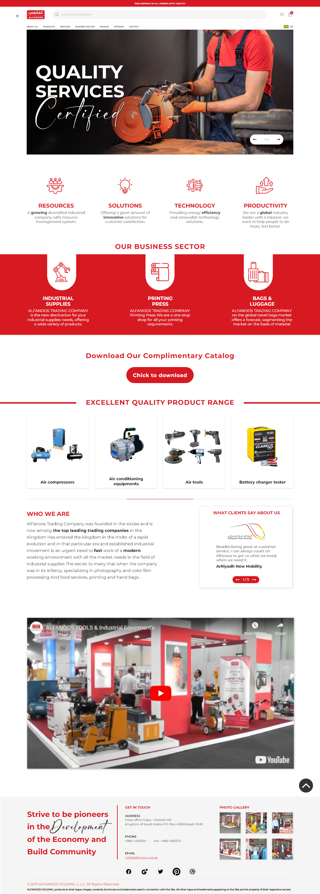
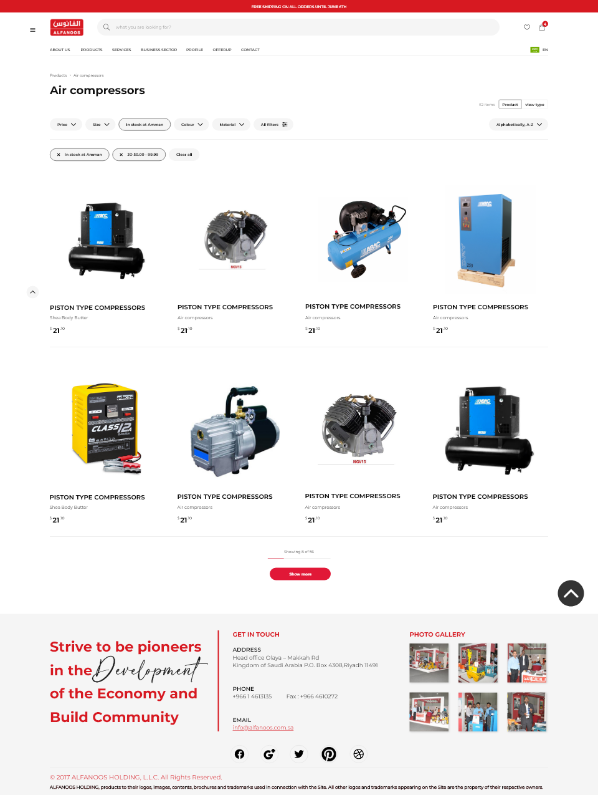

# 🏮 Case Study: Alfanoos E-commerce Platform

### [ Frontend Architecture | API Development | SQL Data Persistence ]

**Project Category**: Enterprise E-commerce / Electronics & Retail  
**Role**: Frontend Developer & Full-Stack Contributor  
**Stack**: AngularJS, SQL, RESTful APIs, ERP Logic Integration

---

  

---

## 🔍 Project Overview
**Alfanoos** is a major retail platform requiring a robust architecture to handle high traffic and complex inventory. I developed the frontend using **AngularJS** and contributed to the backend logic, ensuring a real-time sync between the web storefront and the company's **SQL-based ERP system**.

---

## 🚀 Key Technical Contributions

### 🏗️ Enterprise Frontend (AngularJS)
* **Dynamic Mega-Navigation**: Developed a sophisticated menu system to handle diverse product categories with high performance.
* **Product Cataloging**: Engineered a responsive grid system with advanced filtering (Brand, Price, Specs) driven by **SQL** queries.
* **User Engagement**: Built interactive sliders, promotional banners, and a streamlined "Quick Add to Cart" feature.

  

### 🔌 Backend & SQL Integration
* **Data Persistence**: Managed **SQL database** operations to ensure accurate stock levels, pricing, and user order history.
* **API Bridge**: Participated in developing RESTful APIs to connect the AngularJS frontend with the core ERP business logic.
* **Secure Auth Flow**: Implemented the complete user lifecycle, including secure Login, OTP, and Profile Management.

---

## ⚙️ Core Technical Stack
* **Framework**: **AngularJS**.
* **Database**: **SQL**.
* **Integration**: REST APIs & ERP Internal Logic.
* **Optimization**: Asset delivery optimization for fast loading of high-resolution product images.

---

## 👤 Contact Information
* **Name**: Marwa Mahmoud Mohamed
* **📧 Email**: [marwa.sw.eng@outlook.com](mailto:marwa.sw.eng@outlook.com)
* **🔗 LinkedIn**: [marwa-mahmoud-123](https://www.linkedin.com/in/marwa-mahmoud123)
* **💻 Portfolio**: [marwa-mahmoud-sw-eng.vercel.app](https://marwa-mahmoud-sw-eng.vercel.app/)

---
*Disclaimer: This repository is a technical case study. All branding and proprietary code belong to Alfanoos / Triosuite.*
